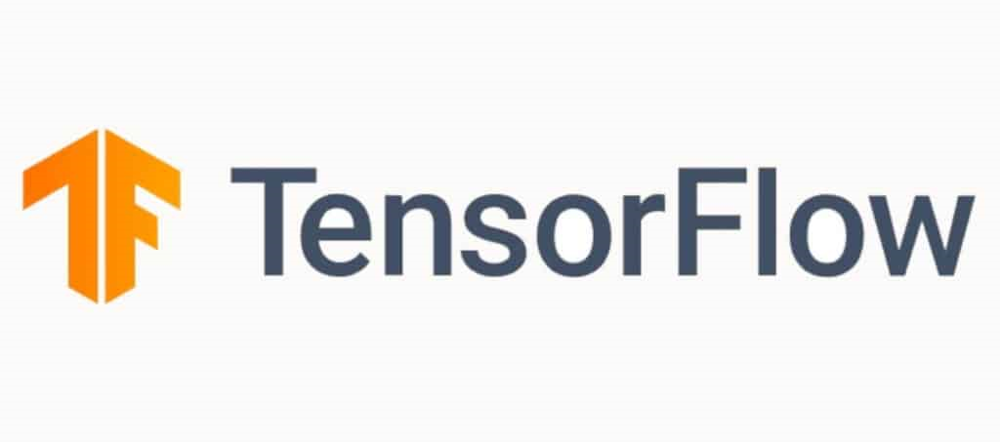

# Practica_TensorFlow-En Construcción :construction:

TensorFlow es una biblioteca de código abierto de Google utilizada para el desarrollo y entrenamiento de modelos de aprendizaje automático y redes neuronales. Facilita la creación de modelos complejos para tareas de reconocimiento de voz, procesamiento de imágenes, traducción automática, y otras aplicaciones de inteligencia artificial.

# Índice

* [Esctructura](#Estructura) 

* [Introducción](#Introducción) 

* [Fuentes de Datos](#Fuentes-de-Datos) 

* [Función de Pérdida](#Función-de-Pérdida) 

* [Autor](#Autor)

# Estructura 

En el momento de crear un modelo en TensorFlow sería bueno tener la siguiente ruta en cuenta:

- Importación o generación del conjunto de datos.
- Transformación y normalización de datos.
- Dividir datos en entrenamiento, prueba y validación.
- Definir los hiperparámetros.
- Crear o inicializar(versiones viejas) variables o placeholders.
- Definir estructura del modelo.
- Declarar la función de pérdidas.
- Inicializar y entrenar el modelo.
- Evaluación del modelo.
- Rejustar hiperparametros.
- Predecir nuevos resultados.

 [Volver al Índice](#Índice)

# Introducción

- Variables y Praceholders
- Tensores
- Matrices
- Estructura de Modelos
- Función de Pérdida 

 [Volver al Índice](#Índice)

# Fuentes de datos

# Función de Pérdida

# Autor

- José R. Guignan
- Mail: joserguignan@gmail.com
- Linkedin: [https://www.linkedin.com/in/jrguignan](https://www.linkedin.com/in/jrguignan)